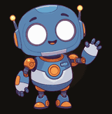

<div align="center">

# My Custom Skills

**A grab bag of skills I pulled out of other projects.**
Not a framework. Not a methodology. Just things that turned out to be useful twice.

[](LICENSE)
[](#-the-skills)
[](#-what-this-is)
[](#-use-it)

</div>

## 🤷 What this is

Every skill in here was built to solve a real problem in some other project of mine. Once it worked,
it got cleaned up, stripped of the project it came from, and dropped in this repo.

So:

- **No roadmap.** Skills land when something interesting comes up. That might be next week. It might be never.
- **No release cadence.** No versioning story. No migration guide.
- **No enterprise anything.** These are not a system. They do not compose. They barely know about each other.
- **No framework lock-in either.** A skill is a folder of scripts and docs. Run it from a terminal
  and you get the same output whether or not an agent is involved. Claude Code is one consumer, not
  the intended reader.
- **They do work, though.** Each one earned its place by doing a real job first.

Take the ones you like. Ignore the rest.

## 🧰 The skills

| | Skill | What it does |
|---|---|---|
|  | **[png-to-animated-svg](plugins/png-to-animated-svg/skills/png-to-animated-svg/)** | Cuts a flat PNG character into named pieces, vectorizes each one, and rigs it so the head tilts, the eyes blink and an arm waves. That robot was one still image until this ran over it. Comes with a working loading screen. |

## 🚀 Use it

Clone the repo, copy the folder you want, install its dependencies, run its scripts. That's it:

```bash
git clone https://github.com/gerard-castell/gerard-custom-skills.git
cp -r gerard-custom-skills/plugins/png-to-animated-svg/skills/png-to-animated-svg ./my-project/
cd my-project/png-to-animated-svg
python3 -m venv .venv && .venv/bin/pip install vtracer pillow
.venv/bin/python scripts/grid.py character.png -o grid.png
```

Each skill's `SKILL.md` reads as plain documentation — the pipeline, the setup, the commands — with
any agent-specific wiring in its own section at the bottom.

<details>
<summary>Other ways in</summary>

**With an agent**

Any agent that can read a folder of docs and run shell commands can follow a skill the same way a
human would — point it at the skill's folder and its `SKILL.md`. Some runtimes have their own
convention for this (an `AGENTS.md` entry point, for example); see [AGENTS.md](AGENTS.md).

**With Claude Code**

Claude Code discovers skills through a plugin marketplace:

```
/plugin marketplace add gerard-castell/gerard-custom-skills
/plugin install png-to-animated-svg@gerard-custom-skills
```

**Dropped in by hand**

For every project you touch:

```bash
cp -r gerard-custom-skills/plugins/png-to-animated-svg/skills/png-to-animated-svg ~/.claude/skills/
```

Or just this one:

```bash
mkdir -p .claude/skills
cp -r gerard-custom-skills/plugins/png-to-animated-svg/skills/png-to-animated-svg .claude/skills/
```

</details>

## 📄 Licence

MIT — see [LICENSE](LICENSE). Take it, break it, ship it.
