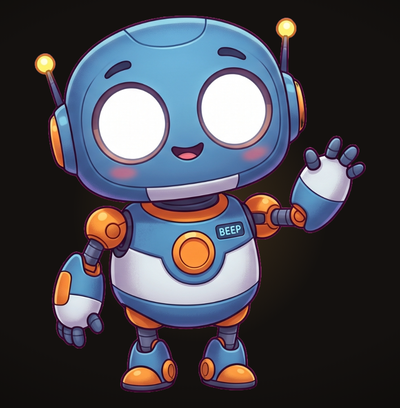
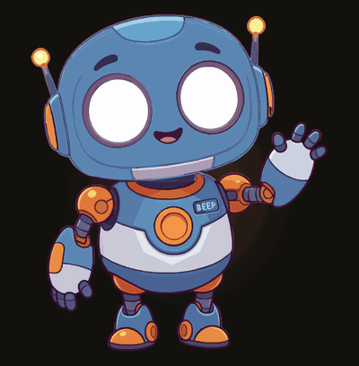

<div align="center">

# png-to-animated-svg

**One flat PNG in. An SVG that waves, blinks and breathes out.**

<table>
<tr>
<td align="center"></td>
<td align="center"></td>
</tr>
<tr>
<td align="center"><code>robot.png</code>, pixels</td>
<td align="center"><code>rigged.svg</code> + a GSAP idle loop</td>
</tr>
</table>

</div>

That is the same drawing on both sides. Nothing was redrawn, and there is no sprite sheet: the PNG
was cut into named pieces, each piece was vectorized from its own cut-out, and the result is an SVG
whose head, eyes, arms and chest light each carry their own transform. It stays sharp at any size.

Nobody measured anything by hand to get there. The agent did.

## ⚡ Use it

Install the skill, then hand it a PNG:

```
/plugin marketplace add gerard-castell/gerard-custom-skills
/plugin install png-to-animated-svg@gerard-custom-skills
```

> *"Animate robot.png as a loading screen."*

That is the whole interface. From there the agent looks at your image, decides what should move,
cuts and traces the pieces, checks its own work in a browser and fixes what came out wrong: the
robot above took about fifteen minutes of that, start to finish.

**What it will ask you.** Which pieces should move, once, before it builds anything. Then it shows
you a preview each round and you say what looks wrong: *the arm swings out of its socket*, *the
head is drifting off the neck*. Two or three rounds is normal, and knowing why a seam opened is
its job, not yours.

**What you get back.** `rigged.svg` (the artwork as named, movable groups) and a working loading
screen around it: idle loop, real progress, reveal.

Any agent that can read a folder and run shell commands works the same way; point it at this folder
and [`SKILL.md`](SKILL.md).

## 🎬 What it is doing while you wait

```
robot.png  →  a labelled coordinate grid, to measure the pieces off
           →  rig.json: each piece named, its region, its pivot, what it is a child of
           →  rigged.svg: every piece traced from its own cut-out, as its own group
           →  a browser preview: tint the pieces, swing each one, catch bad cuts early
           →  GSAP: the idle loop, the progress, the reveal
```

The robot is nine pieces: body, head, two arms, two eyes, two antenna bulbs, chest light. Its rig
is checked in as [`assets/demo/robot.rig.json`](assets/demo/robot.rig.json): regions drawn as
polygons along the shoulder balls, eyes as ellipses with a socket colour painted underneath so a
blink shows an eyelid rather than a hole.

One thing it cannot do for you: the PNG needs a transparent background. Tracing a solid one makes a
single giant shape that swallows the character.

## 🧩 What's in the box

| | |
|---|---|
| `scripts/` | `grid.py` to measure, `rig.py` to cut and trace, `preview.py` to check, `trace.py` underneath |
| `assets/loader.html` | A working loading screen: idle loop, real-progress API, reveal |
| `reference/rigging.md` | Where cut lines go, where pivots go, and what each way it can look wrong means |
| `reference/animating.md` | The idle loop, driving it from real progress, the handover, the lens-dive transition |
| [`SKILL.md`](SKILL.md) | The pipeline as plain documentation, every command, if you would rather drive it yourself |

---
